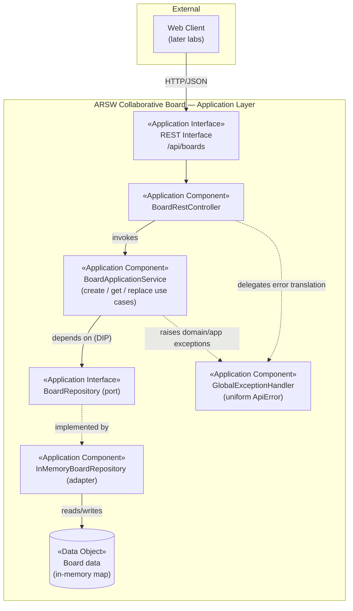

# ArchiMate Application View — Lab 04

Modeled using ArchiMate 3.2 Application Layer concepts (Application Component, Application Interface, Data Object). Rendered as a Mermaid diagram — no Archi/Draw.io installation was available in this environment — with the exact notation mapping documented below so it can be redrawn in Archi/Draw.io if required.

## Notation mapping

| Diagram element | ArchiMate concept |
|---|---|
| `REST Interface` | Application Interface |
| `BoardRestController` | Application Component (exposes the interface, no business logic — RA-01) |
| `BoardApplicationService` | Application Component (realizes the Application Service / use cases) |
| `BoardRepository (port)` | Application Interface (output port, owned by the application boundary — RA-02) |
| `InMemoryBoardRepository (adapter)` | Application Component (realizes the port — RA-03) |
| `Board data (in-memory map)` | Data Object |
| `GlobalExceptionHandler` | Application Component (cross-cutting, centralizes the error contract — RA-05) |

This view matches the package structure actually implemented:
`infrastructure.web.rest` → `application.service` → `application.port.out` → `infrastructure.persistence`.
