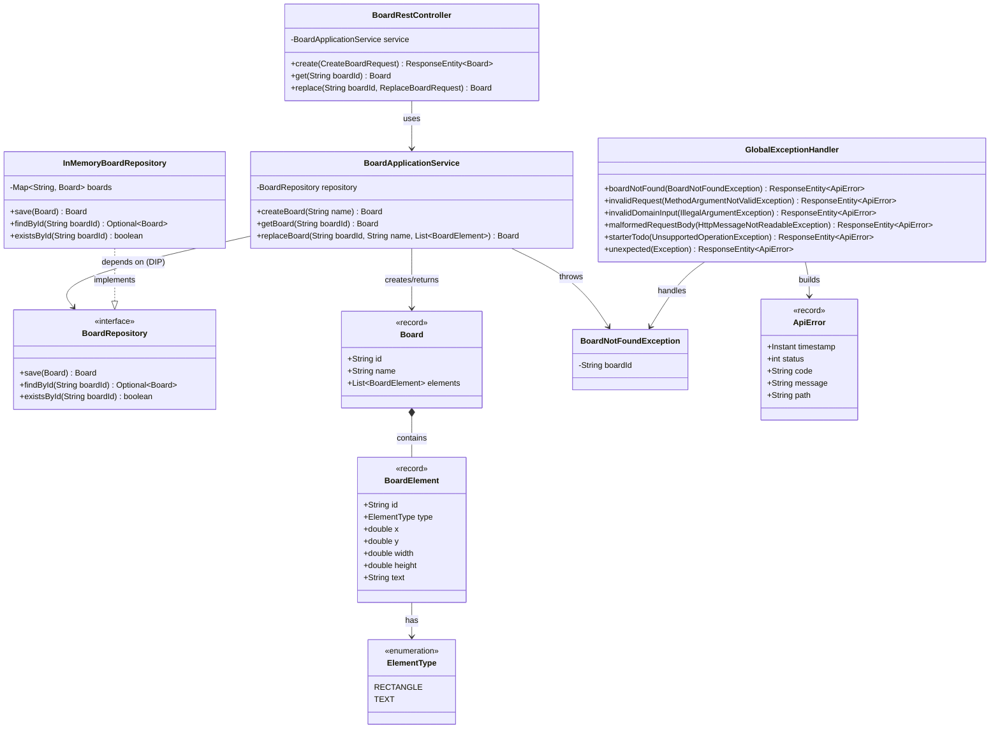

# Class Diagram — Lab 04

Only the classes/interfaces that explain the main structure and their real dependency direction (RA-06).

## Key dependency directions (verifiable in code)

- `BoardRestController` → `BoardApplicationService` → `BoardRepository` (interface). No arrow points from `BoardApplicationService` to `InMemoryBoardRepository` (RA-02).
- `InMemoryBoardRepository` is the only class that implements `BoardRepository` and the only class touching the `Map` (RA-03/RA-07).
- `domain.model` classes (`Board`, `BoardElement`, `ElementType`) have no dependency on Spring, HTTP, or persistence types.
